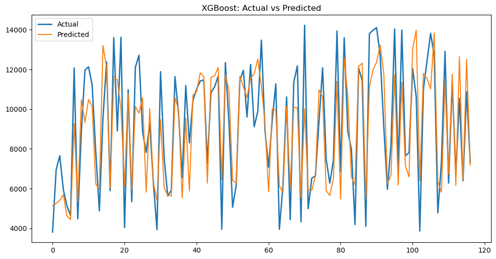

# Dengue-Cases-Analysis-and-Prediction

# Description
I have developed a model using machine learning to predict the Dengue cases using historical data and environmental data. I have used various classification ( Logistic Regression) and Regression models ( Dicision Tree Regression, Linear Regression and XGBoost regresssion ) to analyze the patterns and trends  relation in the Enviromental Data set . This project has helped me improve my skills in statistical analysis, Machine Learning and exploring more models comparision for different Data Sets.

# Overview
This project aims to predict variation in no of dengue cases and to find if there is any relatiion between the enviromental changes using  machine learning techniques. It utilizes historical cases data and enviromental Data to train models and make future  number of cases predictions.

# Technologies Used
  Python
  Machine Learning
  Statistical Analysis
  Kaggle data set
  Pandas
  NumPy
  Matplotlib
  LinearRegression
  LogisticRegressionClassifier
  DicisionTreeRegression
  XGBoostRegression
  Data Visualization 
  Feature Engineering

# Dengue-Cases-Price-Prediction
            │
            ├── dataset-kaggle.com
            ├── overview
            ├── analysis-prediction-ml
            └── README.md

# Features
--> Data preprocessing and cleaning --> Machine learning model training & testing --> Use of Regression & Classification methods --> No of Cases prediction --> Performance evaluation of models  

# Learning OutCome

  Through this project, I gained practical experience in:

 -Data preprocessing and analysis
 -Machine learning model implementation  |Dicion Tree|XGBoost|LinearRegression|LogisticRegression|
 -Biological data prediction
 -Analysis of Data 
 -Statistical modeling and evaluation
 -Prediction Optimization

# Result 

 

        
            
            
